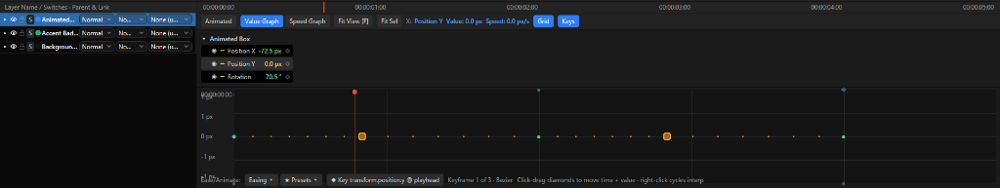
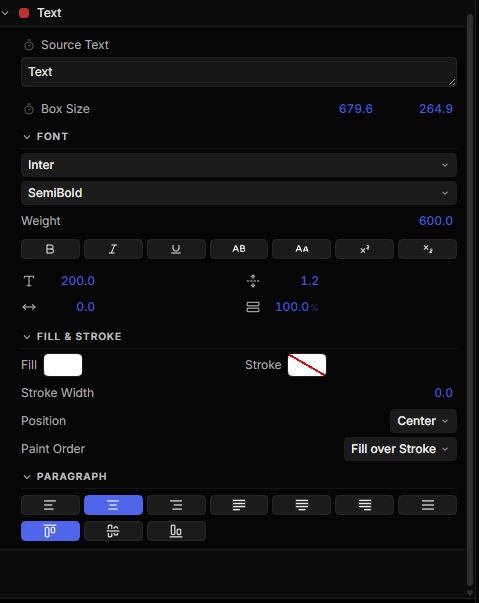
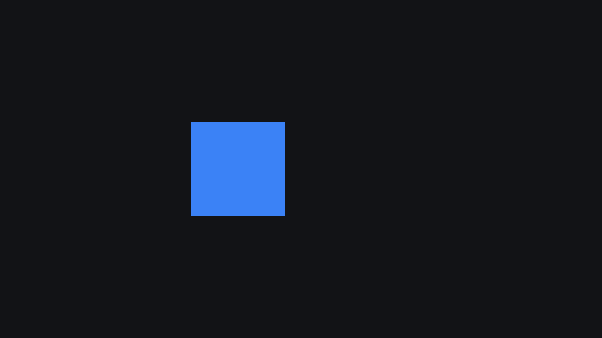

# Motion Effect

A native, cross-platform motion graphics, visual effects, and 2D compositing desktop application built in Rust with GPUI Kit and wgpu.



<p align="center">
  
  
</p>

## Overview

Motion Effect is designed for:
- Motion graphics design and vector animation
- 2D compositing and multi-layer blending
- Video and audio sequencing
- Procedural visual effects and procedural graphics
- Extensible effect pipelines

## Architecture

Motion Effect employs a clean, decoupled modular workspace architecture:

```text
+-------------------------------------------------------------+
|                          GPUI Kit                           |
|      (Main Window, Native Menus, Docking, Panels, Tabs)      |
+-------------------------------------------------------------+
                              |
+-------------------------------------------------------------+
|                          Editor UI                          |
|  (Project Panel, Viewer Panel, Properties, Timeline, etc.)  |
+-------------------------------------------------------------+
                              |
+-------------------------------------------------------------+
|                       Application API                       |
|           (Commands, Undo/Redo, Project Management)         |
+-------------------------------------------------------------+
                              |
+-------------------------------------------------------------+
|                         Compositor                          |
|             (Evaluation, Render Graph, Caching)             |
+-------------------------------------------------------------+
                              |
+-------------------------------------------------------------+
|                          Renderer                           |
|                       (wgpu Pipeline)                       |
+-------------------------------------------------------------+
```

### Crates
- `crates/application`: Native desktop binary, GPUI Kit application bootstrap, dark theme integration, and 4-region docking layout (`ProjectPanel`, `CompositionViewerPanel`, `PropertiesPanel`, `TimelinePanel`, `EffectsPanel`).
- `crates/project`: Pure Rust core project model (`Project`, `Composition`, `Layer`, `LayerSource`, `Transform`, `Property<T>`, `Asset`, `BlendMode`, `Color`, `TimeCode`, `Marker`) with full serialization conforming to Section 16 format.
- `crates/compositor`: Pure Rust scene graph and composition evaluation engine supporting topological evaluation sort (resolving parent-child transform dependencies) and painter's composite rendering order.
- `crates/renderer`: Hardware-accelerated GPU render pipeline with wgpu and compute shaders.
- `crates/export`: Composition renderer that turns an evaluated project into a deliverable file: H.264 MP4, VP9 WebM, animated GIF, numbered PNG sequence, or a single PNG still. Frame rasterization is injected as a callback, so the exporter stays free of UI and GPU dependencies and is fully unit-tested with synthetic frames.

## Rendering a Composition

Any composition can be rendered to a file from the application:

1. Open **File ▸ Export Composition…** (or press `Ctrl+M`).
2. Pick a format — MP4, WebM, GIF, PNG Sequence, or PNG Still.
3. Press **Render** and choose the destination.

Details:
- Frames are rasterized by the same CPU viewport pipeline that draws the composition viewer, so the export matches what you see (masks, blends, effects, parenting, keyframes and all).
- Output is always at full composition resolution; GIFs are downscaled to a capped longest side and resampled to their own frame rate.
- The render runs on a background thread with a live progress bar, so the UI stays responsive.
- MP4 and WebM muxing shells out to `ffmpeg`. It is found via `FFMPEG_PATH` or `PATH`; if it is missing, those formats transparently fall back to writing the PNG sequence and report it in the status bar.
- PNG Still exports exactly the playhead frame; every other format exports the composition's full duration.

## Building and Running

### Prerequisites
- [Rust](https://www.rust-lang.org/) (edition 2021, 1.80+)
- Windows, macOS, or Linux

### Build & Run
```bash
# Build the workspace
cargo build --workspace

# Run the desktop application
cargo run -p application

# Run the test suite
cargo test --workspace

# Run Clippy checks
cargo clippy --workspace --all-targets -- -D warnings
```

## Status
- **Phase 0 (Repository & Build System)**: 100% Complete
- **Phase 1 (Core Engine Architecture)**: 100% Complete
- **Phase 2 (Hardware-Accelerated Rendering Architecture)**: In Progress
- **Composition export**: Complete — MP4 / WebM / GIF / PNG sequence / PNG still, background rendering with live progress (330 passing tests across the workspace)

## License
MIT OR Apache-2.0

